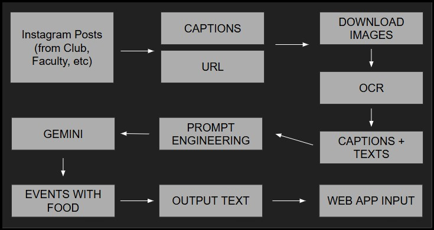

# Find My Dinner

## Overview (HackedBeta 2024 - Honourable Mention)
A brief description of your project.



## Technologies Used

- **Apify Instagram Scraper API**: Used to scrape Instagram posts, extracting captions, hashtags, and media links. This allows us to gather event-related content from Instagram efficiently.
- **Google Vision API (OCR)**: Used for Optical Character Recognition (OCR) to extract text from images, such as event flyers and posters, turning them into machine-readable format.
- **Google Gemini API**: Powers natural language understanding and analysis. It helps with content classification, sentiment analysis, and event-related text generation.

## Project Structure

```
├── captions_extracted/              # Output file for extracted captions from posts
├── downloaded_images/               # Output file for downloaded posts
├── impfiles/                        # Folder containing raw data (JSON file from Apify Instagram Scrapper API)
├── src/                             # Source code directory
│   ├── A_Main.py                    # Main script to run the project
│   ├── B_GoogleVisionExtraction.py  # Google Vision API OCR script
│   ├── C_GoogleAIAPI.py             # Google AI API Gemini Prompt script
│   ├── D_FinalProcessing.py         # Final Data Processing and Export script
│   ├── event.py                     # Event class definition
│   ├── eventcollections.py          # Event collection handling
│   ├── post.py                      # Post class definition
│   └── postcollections.py           # Post collection handling
├── texts_extracted/                 # Output file for OCR extracted text from posts
├── LICENSE                          # Project license file
├── Overview.png                     # Project Overview
├── all_events.txt                   # Output file for D_FinalProcessing.py
└── response.txt                     # Output file for C_GoogleAIAPI.py
